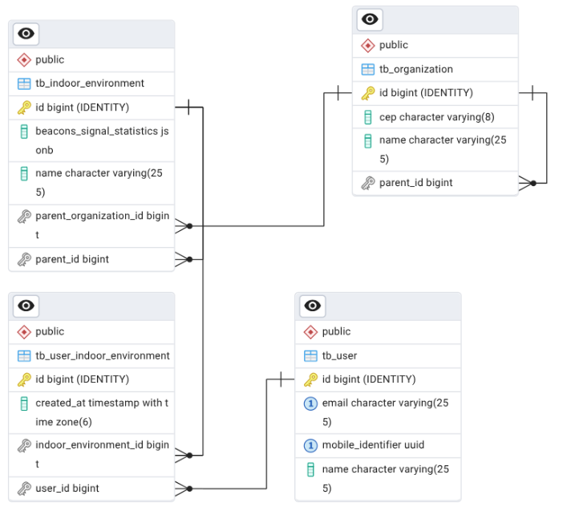

# Indoor backend
- Esta API provê serviços para enviar, organizar e consultar de dados para a localização em ambientes internos de forma hierárquica.

## Tecnologias Utilizadas
- Spring Boot 3.5.9
- Spring Web
- Spring Data JPA
- Spring Validation
- PostgreSQL
- Gradle

## Estrutura do projeto
```
src/main/java
 ├─ common          # Constantes e utilitários compartilhados
 ├─ controllers     # Camada de API (REST)
 ├─ domain
 │   └─ model       # Modelo do domínio
 ├─ services        # Casos de uso / regras de aplicação
 ├─ repositories    # Acesso a dados
 ├─ entities        # Entidades JPA
 ├─ dtos            # Contratos de entrada/saída da API
 └─ exceptions      # Tratamento global de erros
```

### Modelo entidade relacionamento



## Execução do Projeto


### Pré-requisitos

- Java 17
- PostgreSQL
- Gradle

### Build
```
./gradlew build
```

### Executar
```
./gradlew bootRun
```